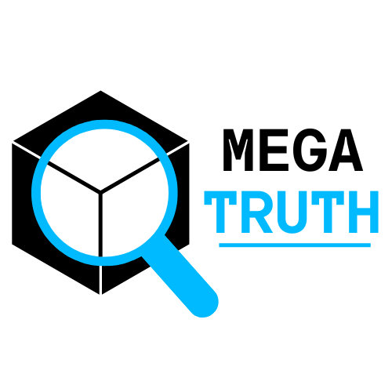

# **MegaTruth 🔍**

<div align="center">
  
  <br>
  <b>Sistema Forense Multimodal para Detecção e Explicação de Imagens Geradas por IA</b>
</div>

---

O **MegaTruth** é uma ferramenta avançada de perícia digital que utiliza uma arquitetura de **Ensemble Híbrido** para detectar anomalias, localizar inconsistências visuais (como mãos deformadas e falhas de iluminação) e gerar laudos técnicos em linguagem natural.

Diferente de detectores simples que apenas dizem "Real" ou "Fake", o MegaTruth explica o **porquê**.

---

## **🧠 Arquitetura do Sistema**

O sistema opera simulando o fluxo de trabalho de uma equipe forense:

### **1. O Juiz (CLIP Fine-Tuned)**
* **Local:** `src/models/clip_finetuned`
* **Função:** Classificação de Alto Nível. Analisa texturas invisíveis e ruído de compressão.

### **2. O Analista Semântico (CLIP Base + Configs)**
* **Local:** `src/models/config/concepts.txt`
* **Função:** *Concept Bottleneck*. Se a imagem é suspeita, este modelo varre uma lista de **80+ conceitos forenses** (ex: "mãos deformadas", "física impossível").

### **3. O Artista (CLIPSeg)**
* **Local:** `src/models/vision_model_clip.py`
* **Função:** Segmentação Semântica. Recebe o defeito encontrado (ex: "olhos assimétricos") e gera uma **Máscara de Evidência** precisa sobre a região, em vez de um mapa de calor genérico.

### **4. O Perito (IA Generativa)**
* **Local:** `src/models/multimodal_model_*.py`
* **Tecnologia:** Híbrida. Usa **Nemotron-12B** (Via API/Nuvem) para máxima inteligência ou **LLaVA** (Local,via ollama) como fallback.
* **Saída:** Um laudo textual detalhado cruzando os dados visuais com o contexto da imagem.

---

## **📂 Estrutura do Projeto**

```bash
MegaTruth/
│
├── images/
│   ├── experiment              # Pasta contendo imagens usadas em alguns experimentos
│   │   ├── erros               # Imagens que deram Falso Positivo ou Falso Negativo
│   │   ├── IA                  # Imagens feitas por IA que foram detectadas corretamente
│   │   └── real                # Imagens Reais que foram detectadas corretamente 
│   ├── inferences/             # Dataset de validação e testes
│   │   ├── AI/                 # (+250 imagens geradas por Midjourney, Flux, etc.)
│   │   └── real/               # (+250 fotografias reais de controle)
│   ├── logo/                   # Assets visuais do projeto
│   └── uploaded/               # Imagens enviadas pelos usuários via Interface
│
├── notebooks/                  # Pesquisa e Desenvolvimento 
│   ├── clip-finetunning.ipynb          # Fine-tuning do classificador especialista (clip)
│   └── concept_bottleneck_eval.ipynb   # Validação da sensibilidade semântica (Base vs Tuned)
│
├── outputs/
│   ├── evidence_masks/         # Máscaras de evidência geradas temporariamente
│   └── reports/                # Logs e transcrições de execução
│
├── src/
│   ├── models/                 # O "Cérebro" do sistema
│   │   ├── clip_finetuned/     # pasta contendo arquivos do clip fine-tuned
│   │   ├── config/             # Configurações de conhecimento
│   │   │   ├── anchors.txt     # Mapeamento Conceito -> Objeto Visual para o clip no defect_map
│   │   │   └── concepts.txt    # Lista de defeitos de IA conhecidos para o clip no concept bottleneck
│   │   ├── vision_model_clip.py           # modelo de visão (classificação + concept bottleneck + mapa de calor)
│   │   ├── multimodal_model_llava.py      # modelo multimodal local (Explicação da classificação)
│   │   └── multimodal_model_nemotron.py   # modelo multimodal Nuvem (via API da Open Router - explicação da classificação)
│   │
│   ├── test/                   # Scripts de Teste e Debug dos modelos multimodais
│   │   ├── main_app_llava_test.py
│   │   └── main_app_nemotron_test.py
│   │
│   └── ui/                     # Frontend
│       └── gradio_app.py       # Interface Web Principal
│
└── requirements.txt
```

## **🚀 Instalação e Execução**

### **1. Pré-requisitos**

- Python 3.10 ou superior.
- Placa de vídeo NVIDIA (recomendada para performance com CUDA).
- Ollama instalado (se for usar o modo Local/Offline)
> 🔗 Disponível em: **https://ollama.com/download**

### **2. Instalação das dependências**

Abra um terminal na pasta raiz do projeto e execute:

```bash
# 1. Crie um ambiente virtual (recomendado)
python -m venv venv

# 2. Ative o ambiente (PowerShell)
venv\Scripts\Activate.ps1

# 3. Instale os pacotes necessários
pip install -r requirements.txt
```

**Observação**: no `cmd.exe` a ativação é `venv\Scripts\activate` e no `bash`/`zsh` (Linux/Mac) é `source venv/bin/activate`.

### **3. Configuração (opcional — modelo multimodal Via API)**

O sistema funciona offline com o LLaVA, mas para laudos periciais mais consistentes e de alta qualidade recomenda-se usar o Nemotron via OpenRouter.

Abaixo estão as instruções completas para criar sua chave e configurar o ambiente.

---
### **🌐 1. Criar uma conta no OpenRouter**

Acesse o site oficial: 🔗 https://openrouter.ai

Para criar sua conta:

1. Clique em **Sign Up** no canto superior direito.
2. Escolha como deseja se registrar:
   - Google  
   - GitHub  
   - E-mail + senha
3. Após o cadastro, confirme seu e-mail (caso solicitado).
4. Faça login normalmente acessando **Sign In**.
5. Depois de logado, você será direcionado ao painel principal (**Dashboard**).

A partir daí, você já pode criar sua API Key.

---

### 🔑 2. Como criar sua API Key no OpenRouter

1. Entre no site: https://openrouter.ai  
2. Clique em **Sign Up** (se ainda não tiver conta) ou **Sign In** (para entrar).  
3. Após logar, vá até a página:  
   **API Keys → https://openrouter.ai/settings/keys**
4. Clique em **Create Key**.  
5. Escolha um nome para a chave (ex.: `nemotron-producao`)  
6. Copie a chave gerada **imediatamente** — ela só aparece uma vez.  
7. Guarde em local seguro e não compartilhe com ninguém.

---

### 🗂️ 3. Configurar o arquivo `.env`

Crie um arquivo `.env` na raiz do projeto com:

```ini
OPENROUTER_API_KEY="sua-chave-aqui"
```

Se o `.env` não existir ou a chave for inválida, o sistema fará fallback automático para o LLaVA local.

### **4. Download do clip Fine-Tuned**

O GitHub não permite versionar arquivos maiores que **100 MB**, por isso o modelo **CLIP Fine-Tuned** não está incluído diretamente no repositório.

Para obter uma melhor precisão na classificação das imagens, baixe o modelo Fine-Tuned manualmente pelo link abaixo:

🔗 Disponível em: **https://drive.google.com/drive/folders/1kwe6CK709BzBrYZ7miaHf2G9k1N_dWBs?usp=sharing**

Após o download:

1. Crie uma pasta nomeada de **clip_finetuned** no seguinte caminho do projeto:

```bash
src/models/clip_finetuned
```

**2. Extraia o conteúdo do arquivo `.zip` dentro dessa pasta.**

A estrutura final deve ficar assim:

```bash
src/
└── models/                
       └── clip_finetuned/           <-------- PASTA DO CLIP FINE-TUNED
                ├── config.json
                ├── merges.txt
                ├── model.safetensors
                ├── preprocessor_config.json
                ├── special_tokens_map.json
                ├── tokenizer_config.json
                ├── tokenizer.json
                └── vocab.json
       ├── config/             
       ├── vision_model_clip.py        
       ├── multimodal_model_llava.py  
       └── multimodal_model_nemotron.py
```

### **5. Executando a interface (Gradio)**

Inicie a interface com:

```bash
python src/ui/gradio_app.py
```

Após alguns segundos o terminal exibirá um link local (ex: `http://127.0.0.1:7860`). Segure a tecla **ctrl** e clique com o botão esquerdo no `http://127.0.0.1:7860` para Abrir no navegador.

## **🧪 Pesquisa & Validação**

O projeto inclui notebooks que validam a eficácia da arquitetura híbrida:

- `notebooks/concept_bottleneck_eval.ipynb`: demonstra que o CLIP Base possui maior sensibilidade para a detecção conceitos de imagens gerados por IA, enquanto o Fine-Tuned atua como filtro para reduzir falsos positivos.
- `notebooks/clip-finetunning.ipynb`: documenta o processo de fine-tuning do do modelo em detecção de imagens geradas por IA


## 💡 Roadmap do MegaTruth (Checklist)

Aqui está o *roadmap* do MegaTruth formatado como uma lista de verificação (checklist), detalhando os subtópicos e entregáveis para cada módulo planejado.

---

### 1. GUI (Gradio/Streamlit)

Criação da interface de usuário **simples e funcional** para demonstrações e usabilidade.

* [x] **Design e Estrutura Inicial (MVP):**
    * [x] Definir o *framework* de UI (Gradio/Streamlit).
    * [x] Definir o *framework* de UI (Gradio)
    * [x] Implementar o componente de **Upload de Imagem** (`PNG`, `JPG`).
* [x] **Módulo de Saída Principal:**
    * [x] Exibir **Rótulo de Classificação** (`Real` vs `IA`) e **Confiança**.
    * [x] Área dedicada à visualização do **defect_map** (Grad-CAM).
    * [x] Caixa de texto para a **Explicação Textual** (saída do LLaVA).
* [x] **Funcionalidades Adicionais:**
    * [x] Criar um **Histórico Simples** de análises da sessão.

---

### 2. Finetuning do CLIP

Melhoria da precisão e **robustez** do classificador CLIP para o domínio *real vs IA*.

* [x] **Preparação do Dataset Especializado:**
    * [x] Curadoria de um **dataset balanceado** (Real vs. IA de múltiplos modelos generativos).
    * [x] Implementar **Estratégia de Aumento de Dados** (*Data Augmentation*) simulando compressão (JPEG) e ruído.
* [x] **Implementação do Finetuning (LoRA):**
    * [x] Selecionar o *backbone* CLIP e definir a **arquitetura LoRA**.
    * [x] Treinar o modelo utilizando LoRA e definir hiperparâmetros (taxa de aprendizado, épocas).
* [x] **Avaliação e Comparação:**
    * [x] Estabelecer a **linha de base (*baseline*)** do CLIP sem *finetuning*.
    * [x] Avaliar o modelo *finetunado* em métricas como **Acurácia, AUC e F1-Score**..

---

### 3. Concept Bottleneck (Explicabilidade Profunda)

Fornecer explicações intermediárias baseadas em **conceitos semânticos e visuais** de artefatos. 

[Image of a Concept Bottleneck Model diagram showing input, concept layer, and output]


* [x] **Definição de Conceitos:**
    * [x] Definir uma ontologia de **artefatos de IA** e **inconsistências visuais** (ex: "Dedos Deformados", "Textura Irregular").
    * [ ] Rotular um subconjunto do *dataset* com a **presença/ausência** desses conceitos.
* [x] **Validação do Extrator de Conceitos:**
    * [x] Avaliar se o CLIP Base (Zero-Shot) possui sensibilidade suficiente para atuar como o Gargalo Conceitual (CBM) sem necessidade de treino adicional.
* [x] **Integração ao LLaVA:**
    * [x] Modificar o *prompt* do LLaVA para incluir a **Lista de Conceitos Preditos**.
    * [x] Instruir o LLaVA a **incorporar esses conceitos** na explicação textual.
